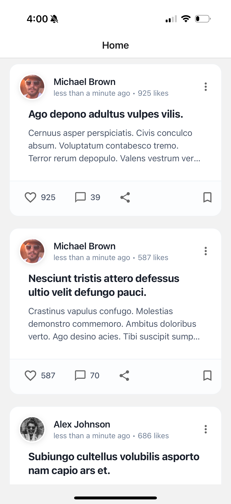

# 📱 Social App

Welcome to our social app built with React Native and Expo! This app lets you browse posts, view comments, and interact with content from the GoREST API. It's a clean, responsive mobile application that demonstrates modern React Native development practices with TypeScript.

## 📱 App Screenshots

<div style="display: flex; flex-wrap: wrap; gap: 16px; margin: 20px 0;">
  <div style="flex: 1; min-width: 200px;">
    
    <p style="text-align: center; margin-top: 8px; color: #4a5568;">Home Feed</p>
  </div>
  <div style="flex: 1; min-width: 200px;">
    
    <p style="text-align: center; margin-top: 8px; color: #4a5568;">Post Details</p>
  </div>
  <div style="flex: 1; min-width: 200px;">
    
    <p style="text-align: center; margin-top: 8px; color: #4a5568;">Comments</p>
  </div>
</div>

## What's Inside

### Home Feed
- Browse through a feed of posts from different users
- Each post shows:
  - Who posted it (with avatar)
  - The post title and a preview
  - When it was posted

### Post Details
- Tap any post to see:
  - The full post content
  - Author information
  - All the comments on that post

### Comments
- See what people are saying
- View commenter avatars and names
- Clean, readable comment threads

## Tech Stack

- **Frontend**: React Native with Expo
- **Language**: TypeScript
- **Navigation**: React Navigation
- **Data**: GoREST API
- **Icons**: Expo Vector Icons

## Getting Started

### Prerequisites
- Node.js (v14 or later)
- npm or yarn
- Expo CLI (install with `npm install -g expo-cli`)

### Installation

1. Clone the repository:
   ```bash
   git clone [your-repository-url]
   cd social-app
   ```

2. Install dependencies:
   ```bash
   npm install
   # or
   yarn install

3. Start the development server:
   ```bash
   npx expo start
   ```

   This will open the Expo Developer Tools in your browser. From there, you can:
   - Run on iOS simulator (macOS only)
   - Run on Android emulator
   - Use the Expo Go app on your physical device

## Running the App

### On Physical Device
1. Install Expo Go on your iOS or Android device
2. Scan the QR code from the terminal or Expo Dev Tools
3. The app will load on your device

### On Simulator/Emulator
- For iOS: Press `i` in the terminal or click 'Run on iOS simulator' in Expo Dev Tools
- For Android: Press `a` in the terminal or click 'Run on Android device/emulator' in Expo Dev Tools

## Project Structure

Here's a quick overview of the main directories:

```
src/
  ├── components/     # Reusable UI components
  ├── screens/        # App screens
  ├── services/       # API and data services
  ├── types/          # TypeScript type definitions
  └── utils/          # Utility functions and helpers
```

## Features in Detail

### Post Feed
- Infinite scrolling for smooth browsing
- Pull-to-refresh to get the latest posts
- Clean card layout with author info and post preview

### Post Details
- Full post content with proper formatting
- Author information with avatar
- Comment section with user avatars

## Contributing

Found a bug or have an idea for a new feature? I'd love to hear about it! Here's how you can help:

1. Fork the repository
2. Create a new branch for your changes
3. Make your changes and commit them
4. Push to your fork and open a pull request

## License

This project is open source and available under the [MIT License](LICENSE).

## Acknowledgments

- Built with ❤️ using React Native and Expo
- Data provided by [GoREST API](https://gorest.co.in/)
- Icons from Expo Vector Icons

---

